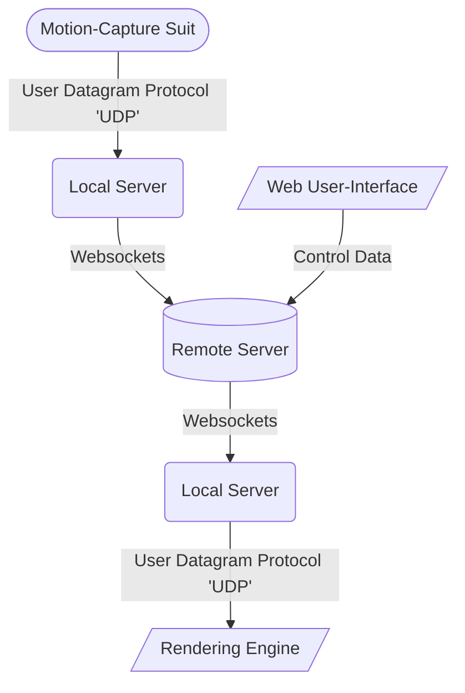

# Stuff to do
- IPC communiction between main and renderer in electron is currently untyped which is a cause for potential errors. Because the communication is largely (if not all) based around the websocket comms which already use fully typed messages (see shared/messages), I should just use that message type (call it Message rather than WsMessage because it's not exclusively a websocket message protocol.

- maybe move ws.on("message") stuff to main/index rather than in main/remote that way newRemoteWs just builds a WS 
  or errors and returns and all the juicy stuff happens in index

- Handle errors in the UI everywhere.

- review all routes through the program (e.g. connect only, connect and join, rename, etc) and make sure we can't get into silly states and are handling errors correctly

# About

The Goldsmiths Mocap Streamer consists of objects for transmitting labelled bounding volume hierarchy (BVH) data in real-time.

You can [download a pre-built version of our application](https://github.com/goldsmocap/axis-streamer/releases/latest). Alternatively, you can [build your own from our source code](https://github.com/goldsmocap/axis-streamer/blob/main/README.md#making-a-release). (Please note: you will need to [deploy your own remote server](https://github.com/goldsmocap/axis-streamer/tree/main/remote#deploying-to-digital-ocean) in any instance) 

This codebase is entirely open to forks and contributions via our [GitHub](https://github.com/goldsmocap/axis-streamer/), subject to our [MPL License](https://github.com/goldsmocap/axis-streamer/blob/main/LICENSE)

*TODO: add gitstats*

## Project Overview:

The streamer is essentially a Websockets wrapper for UDP data, allowing users to stream to ports over the web as though they were local. 

It works like this:

# Development

## Project Setup

*Prerequisites: git, node, yarn*

1. Clone the project from github `git clone https://github.com/goldsmocap/mocap-streamer`

2. Navigate to the project root and install dependencies: `yarn`

## Run Locally

1. Start the remote axis-streamer: run `yarn remote dev` from the project root.

    This starts the remote server running on `locahost` port `3000`.

2. Start the local axis-streamer: in a new terminal run `yarn local dev` from the project root.

    This starts the local server running on `localhost` port `4000`.

3. Start the web-ui: in a new terminal run `yarn local-webui serve` from the project root.

# Making a Release

*pre-requisites: node, node-pkg*

## Release Remote-Streamer

__Publish Docker Image__

*NOTE: Docker and access to the axis-streamer DockerHub account is required for this step*

The remote streamer is released to a public DockerHub repository and can be deployed on any server running Docker.

Docker images for the remote streamer are created automatically by a Github Action which is triggered by creating and pushing a tag with the following pattern: `remote_x.y.z`.

1. Make sure your code is commited and pushed to the `main` branch.

2. Create a new tag for the latest release. `git tag -a 'remote_x.y.z'` (replace `x.y.z` with a version number).

3. (Optional) You may be prompted to provide a message for the tag.

4. Push the tag to Github. `git push --tags`

Assuming there are no error building and deploying the image; after a few minutes a new Docker image will appear on DockerHub with the version number you provided. The `latest` tag will also be updated to point at this new version.

You can check on the progress of this release by opening the project github.com in a browser and navigating to actions tab. You will see a list of all previous runs including the one triggered by your pushed tag.

__Deploy to Goldsmiths Digital Ocean Server__

This is done by manually triggering the `Deploy Remote` workflow in github.com.

1. Open the project in github.com `https://github.com/goldsmocap/mocap-streamer`.

2. Navigate to the actions tab.

3. In the left-hand panel select `Deploy Remote`.

4. Select `run workflow` from the dropdown on the right hand of the page.

Assuming there are no errors the Digital Ocean server running in London (IP addr: `46.101.24.208`) will redeploy with the latest docker image in DockerHub.

## Release Local-Streamer

This process requires `pkg` which can be install via `npm install -g pkg`

1. Build the executables by running `yarn local pkg`.

    This creates a new directory `remote/bin` which contains 3 executables, 1 for windows, 1 for mac and 1 for linux.

2. Open a browser and navigate to the github page for the project `https://github.com/goldsmocap/mocap-streamer` and create a new release using the 3 binaries you ject created.