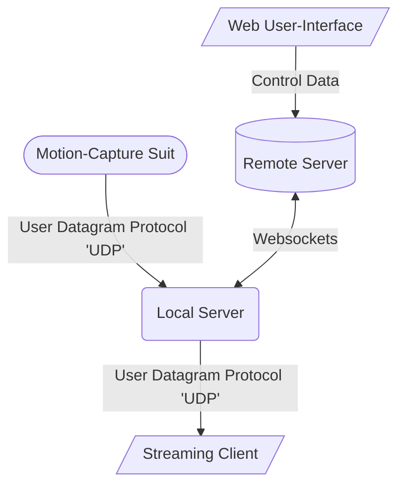

# About

Goldsmiths Mocap Streamer is a cutting-edge tool that streams live motion capture data over the internet, allowing users from multiple remote locations to interact in the same shared digital space.

This is achieved with 3 modules: a [remote server](/remote/README.md), a [local server](/local/README.md), and a [local web user-interface](/local-webui/README.md) to control the two. 

Data is exchanged as follows:

(More information on dataflow paradigms in the streamer can be found [here](/project_overview.md))

# Development

## Project Setup

*Prerequisites: git, node, yarn*

1. Clone the project from github: `git clone https://github.com/goldsmocap/axis-streamer`

2. Navigate to the project root and install dependencies: `yarn install`

## Run Locally

1. Start the remote axis-streamer: run `yarn remote dev` from the project root.

    (This starts the remote server running on `locahost` port `3000`)

2. Start the local axis-streamer: in a new terminal run `yarn local dev` from the project root.

    (This starts the local server running on `localhost` port `4000`)

3. Start the web-ui: in a new terminal run `yarn local-webui serve` from the project root.

# Making a Release

*pre-requisites: node, node-pkg*

## Release Remote-Streamer

__Publish Docker Image__

*NOTE: Docker and access to the axis-streamer DockerHub account is required for this step*

The remote streamer is released to a public DockerHub repository and can be deployed on any server running Docker.

Docker images for the remote streamer are created automatically by a Github Action which is triggered by creating and pushing a tag with the following pattern: `remote_x.y.z`.

1. Make sure your code is committed and pushed to the `main` branch.

2. Create a new tag for the latest release. `git tag -a 'remote_x.y.z'` (replace `x.y.z` with a version number).

3. (Optional) You may be prompted to provide a message for the tag.

4. Push the tag to Github. `git push --tags`

Assuming there are no errors in building and deploying the image; after a few minutes a new Docker image will appear on DockerHub with the version number you provided. The `latest` tag will also be updated to point at this new version.

You can check on the progress of this release by opening the project [github](https://github.com/goldsmocap/axis-streamer) in a browser and navigating to actions tab. You will see a list of all previous runs including the one triggered by your pushed tag.

__Deploy to Goldsmiths Digital Ocean Server__

This is done by manually triggering the `Deploy Remote` workflow in [github](https://github.com/goldsmocap/axis-streamer).

1. Open the project in [github](https://github.com/goldsmocap/axis-streamer).

2. Navigate to the actions tab.

3. In the left-hand panel select `Deploy Remote`.

4. Select `run workflow` from the dropdown on the right hand of the page.

Assuming there are no errors, the Digital Ocean server running in London (IP addr: `46.101.24.208`) will re-deploy with the latest docker image in DockerHub.

## Release Local-Streamer

This process requires `pkg` which can be installed via `npm install -g pkg`

1. Build the executables by running `yarn local pkg`. (This creates a new directory `remote/bin` which contains 3 executables: 1 for windows, 1 for mac and 1 for linux)

2. Open a browser, navigate to the project [github](https://github.com/goldsmocap/axis-streamer) and create a new release using the 3 binaries you just created.