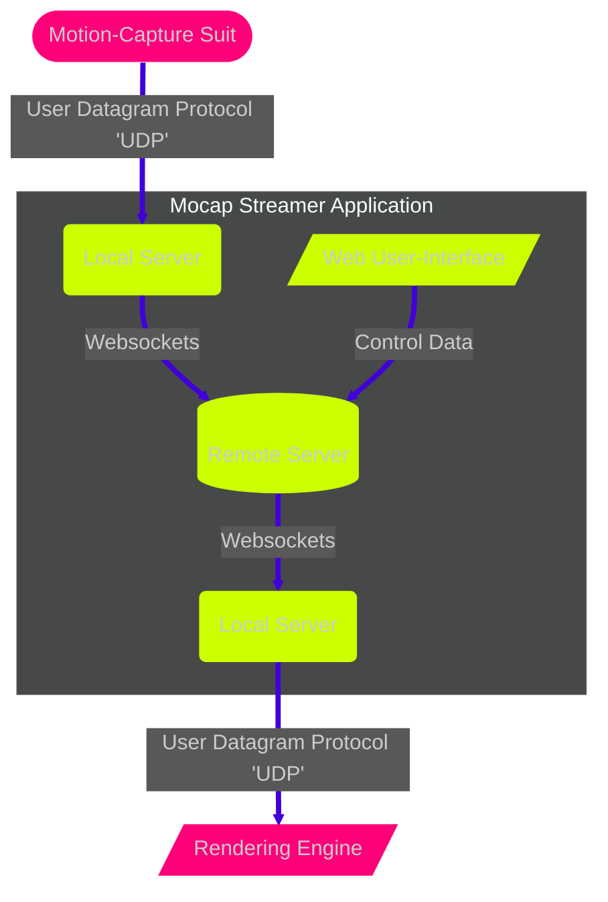

<!--- the subgraph styling is handled by '.cluster rect 2' so I'm loading a 'dark' init theme to colour it grey while staying in markdown. Feel free to change once implementing in a website with stylesheets--->

