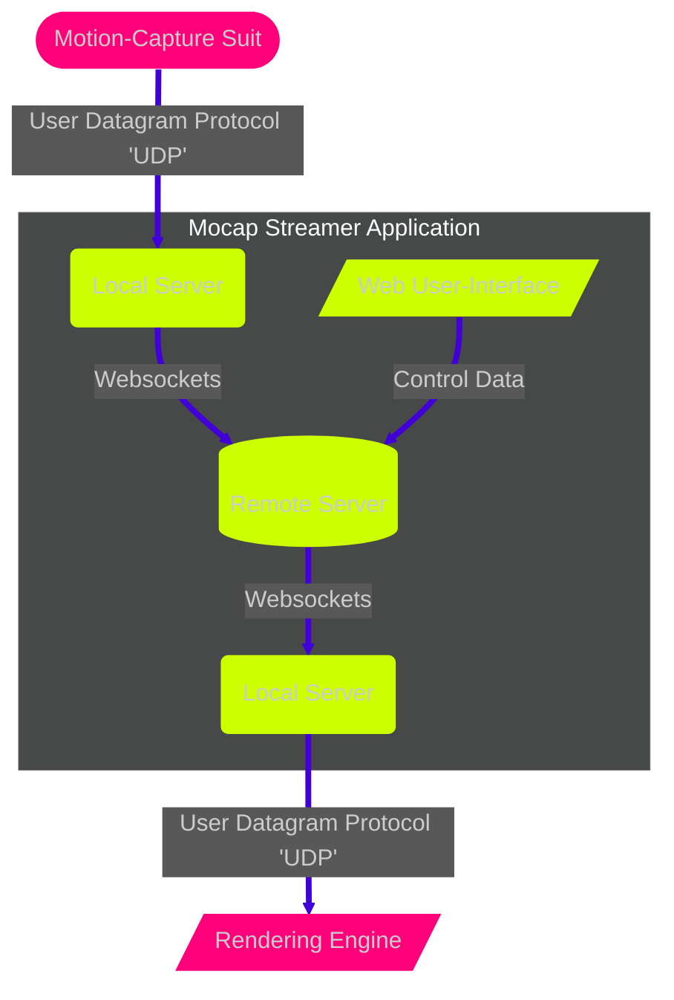

# About

The Goldsmiths Mocap Streamer consists of objects for transmitting labelled bounding volume hierarchy (BVH) data over the web in real-time.

The codebase is entirely open to forks and contributions via our [GitHub](https://github.com/goldsmocap/axis-streamer/), subject to our [MPL License](https://github.com/goldsmocap/axis-streamer/blob/main/LICENSE)

<!-- Repo Card -->
 

<!--- Using html to add CSS ID "gitBadge"--->

 

After [deploying your own remote server](https://github.com/goldsmocap/axis-streamer/tree/main/remote#deploying-to-digital-ocean) to host the data stream, you can either:

- [Download a pre-built version of our streaming application](https://github.com/goldsmocap/axis-streamer/releases/latest) (recommended) or,
- [Build your own from our source code](https://github.com/goldsmocap/axis-streamer/blob/main/README.md#making-a-release)

We also have a number of [quick start objects and guides for both Unreal and Unity](https://app.gitbook.com/o/MtYGZjwZQdzw3gS72cG9/home), though the streamer works with any engine that supports BVH streaming.

## Project Overview:

The streamer is essentially a Websockets wrapper for UDP data, allowing users to stream to ports over the web as though they were local. 

It works like this (click on an element to read more on its GitHub page):

<!--- the subgraph styling is handled by '.cluster rect 2' so I'm loading a 'dark' init theme to colour it grey while staying in markdown. Feel free to change once implementing in a website with stylesheets--->

###Credits:

Flowchart built using [MermaidJS](https://mermaid-js.github.io/mermaid/#/). Repo stats using [GitHub Readme Stats](https://github.com/anuraghazra/github-readme-stats#readme) API.