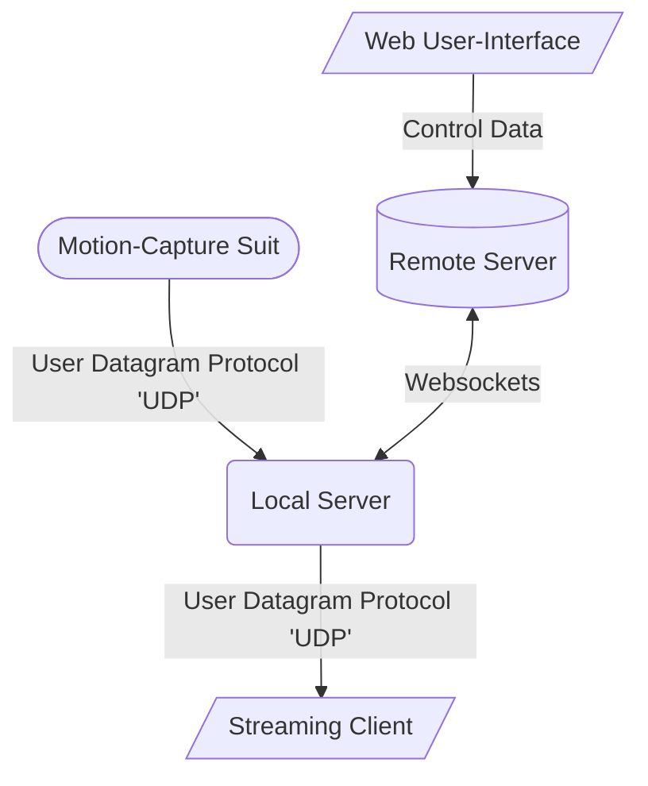
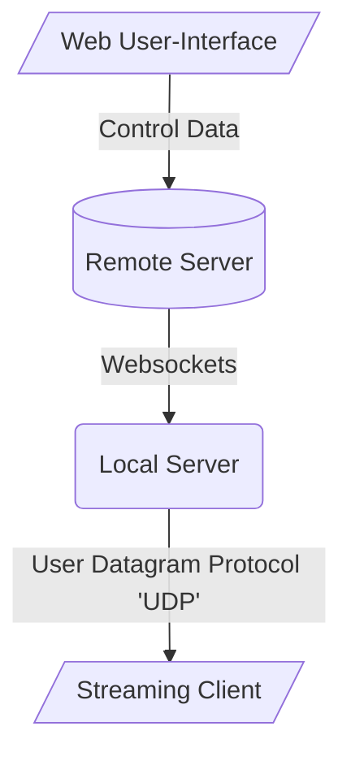

# Project Overview:

## Sending and Receiving Data:

```mermaid
  flowchart TD;

    Suit([Motion-Capture Suit])--User Datagram Protocol 'UDP'-->
    Local(Local Server);
    
    UI[/Web User-Interface/]--Control Data-->
    Remote[(Remote Server)]<--Websockets-->
    Local(Local Server)--User Datagram Protocol 'UDP'--> 
    Client[/Streaming Client/];


    
    click Local "https://github.com/goldsmocap/axis-streamer/blob/main/local/README.md" "See the README for the 'Local Server' component"
    click UI "https://github.com/goldsmocap/axis-streamer/blob/main/local-webui/README.md" "See the README for the 'Web UI' component"
    click Remote "https://github.com/goldsmocap/axis-streamer/blob/main/Remote/README.md" "See the README for the 'Remote' component"
    
    %%click Suit...add docs for suit and set-up
    %%click Client...add docs for using external software with the streamer

```

## Sending Data:

```mermaid
  flowchart TD;

    Suit([Motion-Capture Suit])--User Datagram Protocol 'UDP'-->
    Local(Local Server)--Websockets-->
    Remote[(Remote Server)];

    UIUI[/Web User-Interface/]--Control Data-->Remote; 

```

## Receiving Data:

```mermaid
  flowchart TD;

    UI[/Web User-Interface/]--Control Data-->
    Remote[(Remote Server)]--Websockets-->
    Local(Local Server) -- User Datagram Protocol 'UDP'--> 
    Client[/Streaming Client/];
    
```

