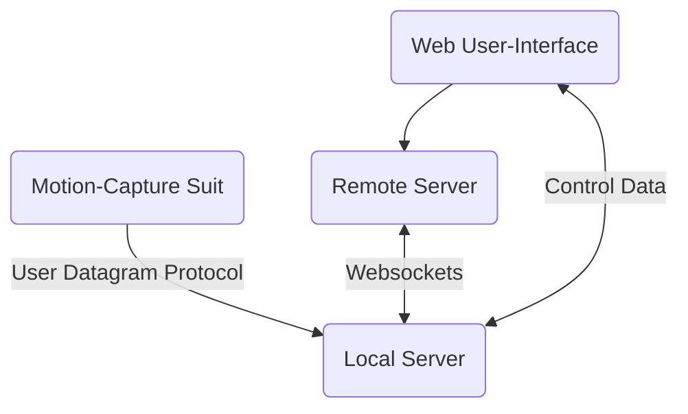

```mermaid
  flowchart TD;

    suit(Motion-Capture Suit)--User Datagram Protocol-->Local(Local Server);
    Remote(Remote Server)<--Websockets-->Local(Local Server);
    UI(Web User-Interface)<--Control Data-->Local;
    UI-->Remote;
    
```