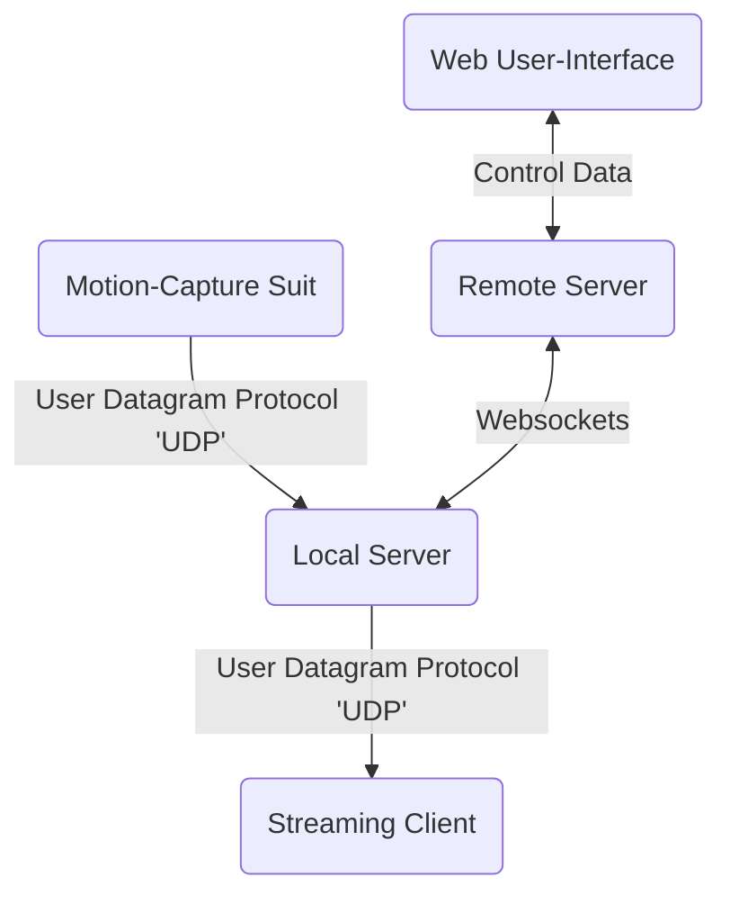
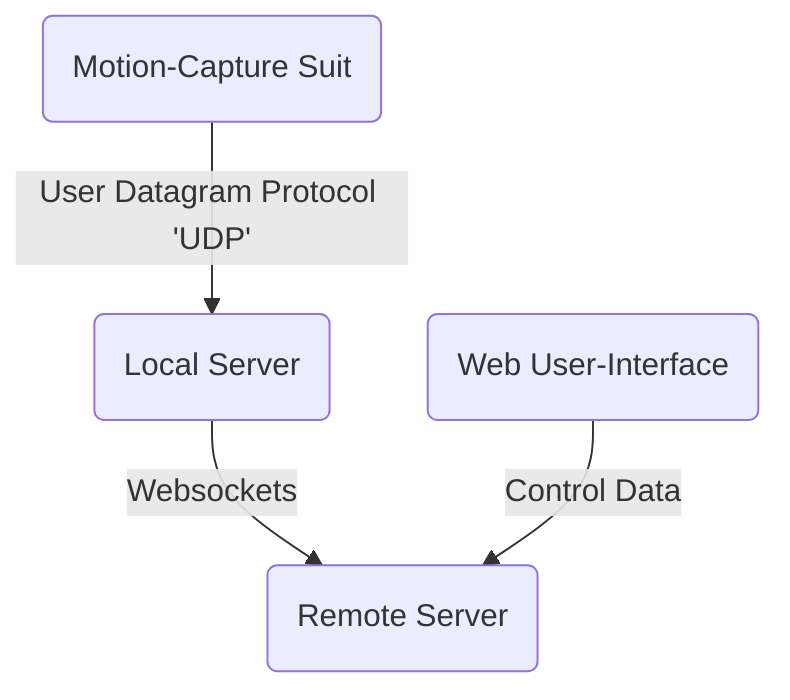
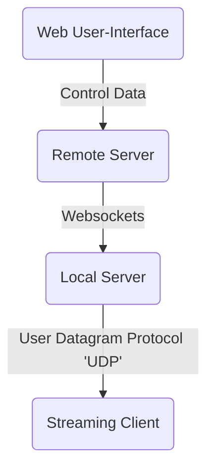

#Dataflow in the streamer:

##Sending and Receiving Data:

```mermaid
  flowchart TD;

    Suit(Motion-Capture Suit)--User Datagram Protocol 'UDP'-->Local(Local Server);
    Remote(Remote Server)<--Websockets-->Local(Local Server);
    UI(Web User-Interface)<--Control Data-->Remote;
    Local(Local Server) --User Datagram Protocol 'UDP'--> Client(Streaming Client);
```

##Sending Data:

```mermaid
  flowchart TD;

    Suit(Motion-Capture Suit)--User Datagram Protocol 'UDP'-->Local(Local Server);
    Local(Local Server)--Websockets-->Remote(Remote Server);
    UI(Web User-Interface)--Control Data-->Remote; 
```

##Receiving Data:

```mermaid
  flowchart TD;

    Remote(Remote Server)--Websockets-->Local(Local Server);
    UI(Web User-Interface)--Control Data-->Remote;
    Local(Local Server) -- User Datagram Protocol 'UDP'--> Client(Streaming Client);
    
```