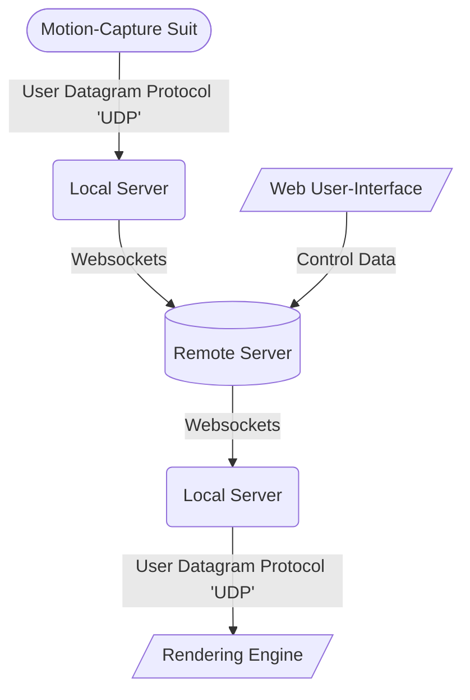

# Mocap Streamer Toolkit:

The Goldsmiths Mocap Streamer consists of objects for transmitting labelled bounding volume hierarchy (BVH) data in real-time.

You can [download a pre-built version of our application](https://github.com/goldsmocap/axis-streamer/releases/latest). Alternatively, you can [build your own from our source code](https://github.com/goldsmocap/axis-streamer/blob/main/README.md#making-a-release). (Please note: you will need to [deploy your own remote server](/readmeMarkdown/remote#deploying-to-digital-ocean) in any instance) 

This codebase is entirely open to forks and contributions via our [GitHub](https://github.com/goldsmocap/axis-streamer/), subject to our [MIT License](https://github.com/goldsmocap/axis-streamer/blob/main/LICENSE)

*add gitstats*

## Project Overview:

The streamer is essentially a Websockets wrapper for UDP data, allowing users to stream to ports over the web as though they were local. 

It works like this:

